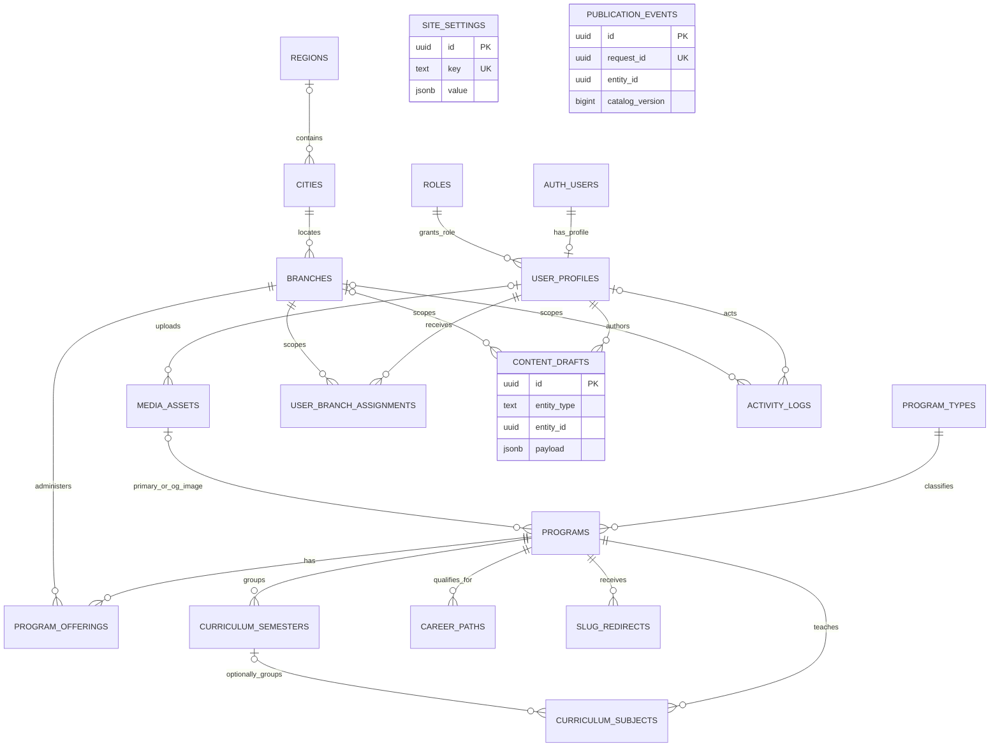

# SSTLI Admin Dashboard Master Specification

Audit date: 9 September 2026. Status: implementation specification; no dashboard implementation or data migration is included in this task.

This document defines an Arabic administrative product for maintaining the SSTLI catalog, its branch offerings, prices, curriculum, images, and website copy. It is intended for the engineer, product designer, and institute owner implementing and accepting that product. The recommendation is to extend the existing Next.js App Router application with an isolated `/admin` area, Supabase PostgreSQL, Auth, and private Storage, while retaining the existing catalog behavior through a compatibility adapter.

**Critical distinction:** the current catalog is a private staff application. “Public website” below means the future visitor-facing catalog described in the request, not the current access policy. Database integration must preserve staff authentication and no-index behavior until the institute explicitly approves a separate public launch. A published record means an approved catalog version; it does not itself authorize anonymous access.

## 1. Existing project audit and evidence

### Scope and method

Inspected first-party application routes, components, TypeScript models, data modules, utilities, authentication implementation, account creation script, styling, configuration, assets inventory, CI workflow, and catalog tests. Evaluated the TypeScript data modules in memory to count actual generated records and check image references. Source code takes precedence over older product notes. Generated `.next`, `out`, dependencies, and credential-bearing documents are not authoritative business-data sources. Credential contents are deliberately excluded from this specification. Responsive findings describe the CSS implementation; this audit does not claim a live browser or deployed-site visual verification.

| Area | Current implementation and evidence |
| --- | --- |
| Framework | `package.json` declares Next `^15.2.0`, React `^19.0.0`, TypeScript `^5.7.3`; lockfile and installed package resolve Next **15.5.25**. App Router, no `src/` directory. |
| Rendering | `app/(staff)/layout.tsx` is `force-dynamic` and calls `requireUser()`. Catalog pages pass imported static records into client components. No active static-export setting. `out/` is an artifact, not the deployment architecture. |
| TypeScript | `types/program.ts`; strict checking, bundler module resolution, `@/*` root alias in `tsconfig.json`. No dedicated hooks directory; React hooks are embedded in components. |
| Current routes | `/`, `/programs`, `/programs/[slug]` under `(staff)`; `/login`; POST `/api/auth/login` and `/api/auth/logout`; `/robots.txt`; loading and not-found boundaries. Route-group names do not appear in URLs. |
| Program source | `data/programs.ts`: helper-generated programs, image maps, shared diploma duration, development-course array; `getProgramBySlug` scans the array. |
| Offering source | `data/offerings.ts`: generated sequential IDs, branch strings, prices, gender, study mode, active flag, diploma payment defaults, one hours override. |
| Geography | `data/branches.ts` and `data/regions.ts` are reference lists, not normalized entities; runtime city filters derive from offerings in `lib/filters.ts`. |
| Explorer | `ProgramExplorer`, `ProgramSearch`, `ProgramFilterChips`, `AdvancedFilters`, `ProgramCard`, `ProgramImage` in `components/programs/`. |
| Details | `components/program-details/ProgramDetails.tsx` selects an offering and displays its price, gender, branch, study mode, and hours; optional flat curriculum and career lists. |
| Payments | `lib/installments.ts`, `InstallmentCalculator.tsx`; estimate only, no payment collection, checkout, finance ledger, or application records. |
| Authentication | `lib/auth.ts`, `lib/session.ts`, `lib/auth-request.ts`, `middleware.ts`, auth route handlers, and `scripts/add-admin.mjs`. Local bcrypt account file; signed eight-hour cookie. No Supabase, persisted roles, database, or dashboard CRUD. |
| Design | `app/globals.css`, `DESIGN.md`, `PRODUCT.md`, `design-system/sstli-programs-explorer/MASTER.md`; CSS tokens and custom classes drive the actual presentation. Tailwind 3 is installed with no theme extensions. |
| UI dependencies | Radix Dialog and Slot, Lucide, Framer Motion, CVA, clsx, tailwind-merge exist. There is **no existing shadcn/ui component collection**, table library, or form/schema library. |
| Hosting | README specifies Vercel's server-capable Next.js preset. `.github/workflows/` runs `npm ci`, tests, and build on Node 22; it does not prove the current remote deployment configuration. |

### Materialized data baseline

| Measurement | Observed value |
| --- | --- |
| Programs | 53: 11 diplomas, 11 qualifying courses, 31 development courses |
| Offerings | 83, all currently `active: true`, all with a numeric price |
| Listed programs without filters | 52; accounting has no offering and is excluded by filtering |
| Online | Four offerings across three diplomas: HR twice, law once, office management once; all 7,999 SAR |
| English | Four qualifying-course records, one month each, `classificationPending: true`; all onsite in Hafr Al Batin, حي المصيف; prices 300, 300, 350, 350 SAR |
| Locations | Six distinct city labels; 13 declared branches, 15 distinct city/branch pairs used by offerings |
| Images | All 53 program references resolve to files; NEBOSH's two records share one image |
| Curriculum | Five diplomas have flat subject lists: law 23, hospital management 12, nursing management 16, cybersecurity 10, AI 19; 80 subjects total |
| Career paths | Ten diplomas have lists; accounting does not |
| Duplicate slugs | None in the evaluated catalog |

### Current catalog behavior

Home renders three category cards linking to `?category=...`. The explorer accepts legacy `category` and current `type`, plus `mode`, `city`, `search`, and `sort`. It changes the URL with `history.replaceState`; it is not a multi-step wizard despite the home progress caption. Filters apply instantly, including within the advanced-filter dialog. Clear removes recognized catalog parameters and preserves unrelated parameters and the hash.

`normalizeSearch` applies NFKC, lowercasing, Arabic diacritic/tatweel removal, alef normalization, ta marbuta to ha, alif maqsura to ya, and whitespace collapse. Search covers name, description, category label/code, specialization, keywords, curriculum, and career paths. Alias groups include HR, AI, IT, English, accounting, law, OSHA, and NEBOSH. Query tokens are ANDed; Latin tokens require word matches, Arabic tokens use substring matches. A WeakMap caches text by program object. Suggestions are the first five filtered programs; choosing one replaces the query with its name. Keyboard arrows, Enter, Escape, and composition handling are implemented.

Category is a program predicate. Active, mode, and city predicates must all match **the same offering**. Programs with no matching offering disappear. Available cities depend on active offerings and selected category/mode, not the search term; a now-invalid selected city remains visible as unavailable. There is no distinct region filter, branch filter, or gender filter today. Price sort uses the minimum numeric price among matching offerings; both sorts leave missing values last. Only one sort is active at a time.

Duration sorting parses Arabic display strings: two-and-a-half years = 912.5 days, two years = 730, a month = 30, two days = 2, numeric months/days are multiplied accordingly. Accredited hours are not elapsed duration. These are sorting estimates, not academic scheduling data.

Cards use the first matching offering for mode, city, and hours, the lowest matching price, and a gender summary. Their link passes the first offering's mode and city, not its exact ID. Consequently a minimum-price card may lead to a different initially selected price when several offerings match. Preserve this during migration parity, then address it as a separately accepted UX correction by passing `offering=<stable-id>` and labeling minimum prices “يبدأ من”.

Details initialize the selection from mode/city or the first active offering; changing it updates displayed values. Hours resolve as `offering.accreditedHours ?? program.accreditedHours`. Law is **84 hours onsite and 75 online**; office management is 80 program hours. Certificate text is hard-coded by category: diploma, completion certificate for qualifying courses, attendance certificate for development courses. Missing hours display “قيد التحديث”; missing prices display “قيد التأكيد”. An unknown slug returns not-found; an existing program without offerings shows “لا يتوفر هذا البرنامج حاليًا”. Accounting's pending-content notice is coded, but its no-offering early return currently prevents the normal detail content from rendering.

There is no actual registration state, registration CTA, contact address/number, discount, fee, offer window, semester, scheduled start date, or publishing workflow in the current model. Returning to the programs list is the detail CTA. Footer copy refers to registration/contact options that are not implemented. Do not infer enrollment functionality from that copy.

### Authentication and SEO reality

The account creation script stores username, display name, bcrypt hash, and optional branch label in `config/admins.json`. The branch label is **not an authorization boundary**: `currentUser()` returns username/name, and every authenticated staff user receives the whole catalog. Branch-account tests check account coverage, not branch-scoped access. Existing staff accounts must not automatically become Super Admins.

The session uses HS256, issuer/audience checks, an eight-hour lifetime, HTTP-only cookies, production Secure, and SameSite Lax. Login/logout reject cross-origin requests; login bounds JSON body size. Middleware protects almost all routes and assets, while server pages recheck account membership. The JSON loader prevents client imports of the account file. No rate limiter is implemented in the inspected login handler.

Root metadata has Arabic title/description and no-index directives; detail metadata authenticates and uses name plus the first 155 description characters. `robots.ts` disallows all crawling. `next.config.ts` globally sets private/no-store and `X-Robots-Tag: noindex, nofollow, noarchive, nosnippet`. No sitemap, canonical URL, explicit Open Graph configuration, or structured course data is implemented. Metadata existing is not evidence of public indexing.

### Hard-coded and inconsistent information register

| Finding | Required treatment |
| --- | --- |
| `region: city` in every generated offering; “regions” list is city-like | Preserve source labels; do not pretend they are Saudi administrative regions. Obtain an approved geography mapping. |
| Dammam offering branches `فرع الدمام`, `حي الشاطئ`, `حي الزهور` absent from branch dictionary | Preserve distinct legacy identities until reviewed; never silently merge with `حي الشاطئ الغربي` or `حي الزهور 1/2`. |
| `حي الضيافة` is declared but unused; `سكوير` is used | Existing `data/todos.ts` asks whether they are the same. Union of declared and used pairs is 16 before any approved merge. |
| `off-1` etc. depend on insertion order | Keep one frozen import map; replace runtime generation with permanent IDs. |
| Offering category duplicates program category | Derive via relationship; do not maintain two editable copies. |
| Development program IDs and prices are parallel arrays | Materialize before import and validate row-by-row; array index is not a durable business key. |
| Development tuple city duplicated and unused by its program mapper | Geography comes from offerings, not this tuple. |
| Diploma duration, 250 down payment, 24 installments generated globally | Import resolved values per offering and preserve duration text. Defaults need institute confirmation. |
| Two NEBOSH records at 250 and 300 | Preserve both IDs, slugs, prices, and shared image pending clarification; similar names alone do not prove duplication. |
| English classification unresolved | Retain current category and onsite mode; no fourth “online English” type is supported by current evidence. |
| Accounting incomplete and unavailable | Keep as an unpublished draft in the proposed editor; preserve its current unavailable URL during parity. |
| Program image position exists in type/component API | Card and detail callers do not pass `program.imagePosition`; exposing a crop editor requires wiring this later. |
| Generic development descriptions and image filename mismatch | Flag for editorial review; e.g. financial-resources references a human-resources-named asset. File existence does not verify artwork accuracy. |
| Category copy, certificate defaults, branding, search aliases, quick payment buttons | Map editable copy/defaults to typed settings; keep component layout and validation rules in code. |
| `PRODUCT.md` describes students and a wizard | README and actual authenticated routes are the current operational truth. |

## 2. Product goal and boundaries

Enable named, authorized employees to maintain every current catalog field without source edits. Primary jobs are locating a program, answering its price in a specific branch, updating verified information, and publishing a reviewed change confidently. The target data flow is catalog frontend → approved Supabase data ← authenticated admin mutations.

This is a catalog administration product, not a student information system. Admissions, payments, attendance, CRM, learning delivery, accounting, and sales reporting are outside the first three phases unless separately commissioned. Do not show revenue, conversion, or enrollment KPIs without those data sources.

## 3. Product vision and working context

Arabic-speaking institute employees use office desktops in normal daylight, often while answering a student's pricing question. Use a light, calm SSTLI interface with readable Arabic, predictable navigation, explicit labels, and short task flows. Preserve Cairo and emerald branding. Desktop should support comparisons; tablets should support the complete single-record workflow. Mobile must allow lookup and urgent safe changes.

Success criteria: an employee can find a branch price without opening several programs; publication cannot accidentally overwrite another branch; saved drafts never leak into catalog reads; incomplete information is visible to editors; existing URLs and calculation results remain compatible through migration.

## 4. Information architecture

Use a right sidebar with these Arabic labels:

| Navigation | Destination and purpose |
| --- | --- |
| نظرة عامة | Overview and actionable exceptions |
| البرامج | One catalog table with saved type tabs: الكل، الدبلومات، التأهيلية، التطويرية; online is a mode filter |
| الفروع | Branch directory and branch-specific catalog |
| الإتاحة والأسعار | Offering rows, prices, registration states, and installment settings in one work area |
| مكتبة الصور | Shared media inventory and usage |
| سجل النشاط | Auditable changes and publish results |
| الإدارة → المستخدمون والصلاحيات | Users, assignments, fixed-role explanation; Super Admin only for management |
| الإدارة → إعدادات الموقع | Website copy, category presentation, search aliases, approved defaults, geography subpage |

Curriculum, careers, images, and SEO belong inside the program editor. Installments belong inside offering pricing. Cities/regions belong with settings and branch location editing. Registration is an offering filter/action, not a disconnected module. This avoids competing edit screens and keeps the program–branch relationship visible. “Online programs” is a saved view, including any future verified online English offering without duplicate records.

## 5. Overview and KPI definitions

Above the fold at 1440×900: page title/date, four compact metrics, then the top actionable issues with direct links. Recommended metrics are total non-archived programs, active published programs, programs with registration open, and programs needing attention. Secondary metrics live in a compact detail strip or expanded view.

| Indicator | Exact meaning |
| --- | --- |
| Total programs | Programs with `archived_at IS NULL`, including drafts |
| Active programs | Published and enabled, excluding archived; do not imply an offering exists |
| Inactive programs | Non-archived programs with `is_active=false`; drafts have a separate count |
| Total branches | Non-archived branch identities; show inactive as a subcount |
| Open registration | Distinct visible programs with at least one enabled offering whose explicit registration state is open |
| Online programs | Distinct programs with a visible online offering, not number of offerings |
| Missing data | Distinct programs with one or more outstanding quality rules; count once |
| Missing pricing | Visible or proposed-active offerings with null original price; show both offering and affected-program counts |
| Missing images | Program has no usable ready media reference, not merely no source path |
| Recently edited | Last ten audit-backed saves/publications; drafts identified separately |

Show recent activity beneath issues, followed by recently edited programs. Offer expiry in the next seven days and starts in the next thirty days appear only when populated. Show “لم تُضف مواعيد بدء” instead of invented timelines. All dashboard metrics and activity respect branch scope; a Branch Manager sees shared program identity but operational counts only for assigned branches. Unknown registration is not closed or open. Current baseline cannot supply a truthful “open registration” count.

## 6. Program model and lifecycle

Keep shared program identity and curriculum separate from delivery/commercial information. Editor fields: Arabic name, optional English name, stable slug, one program type, optional specialization, keywords/tags, optional short description, existing full description, duration display label plus standard/summer labels, optional numeric duration for future sorting, default hours, certificate override, accreditation text, media, content/classification pending flags, featured flag, SEO fields, active state, and archive state.

Mode, gender, price, hours override, administrative branch, registration, and dates belong to offerings. Derived mode/gender badges summarize offerings. Do not add a global editable registration switch that overwrites every branch invisibly.

Lifecycle actions: create draft; edit/save draft; preview; publish; deactivate/reactivate; archive/restore; duplicate; restricted delete. Duplication copies selected shared content and optionally offering drafts, assigns a new UUID and unique slug, clears publication and offer dates, sets registration unknown, and requires explicit price review. It never publishes automatically. Hard deletion is permitted only for never-published, unreferenced drafts, by Super Admin, through an audited server transaction. Published records are archived.

## 7. Program types

Use one `programs` table with `program_type_id` referencing three seeded `program_types`. Current models share the same shape; separate diploma/course tables would duplicate media, SEO, publication, search, and editor behavior. Do not duplicate `category` and `program_type` as independent fields.

Preserve codes `diploma`, `qualifying-course`, `development-course` so current filter links work. Allow category label, home description, certificate default, and installment default to be managed. Adding/removing a type is a later controlled feature because it affects navigation and validation. English level is currently represented by four distinct programs; keep this until the institute confirms whether it wants a level-family relationship. Delivery mode is orthogonal to type.

## 8. Branch management

Branch fields: stable code, Arabic name, city, optional verified region through city, address, phone, WhatsApp, HTTPS map link, optional latitude/longitude, optional audience constraint, enabled state, archive state, and geography verification state. Phone/contact values are unknown today and must remain blank during import.

Directory shows city, branch, active state, distinct offered programs, open/closed/unknown registration counts, and missing-price count. Branch details use Information and Programs & Pricing tabs. Offerings with different modes/audiences remain separate rows. Adding a program to a branch opens the same offering editor used everywhere else. Archiving a branch warns with the count of affected offerings; a branch visibility predicate hides all its offerings without deleting them. Restore shows still-active dependent records before committing.

## 9. Program, branch, offering, price, and availability

An offering is one program delivered/administered by one branch in one mode for one audience. Require a branch even for online offerings because the existing online records have administrative branches. Program → many offerings; branch → many offerings. Mode does not remove administrative ownership.

MVP uniqueness: `(program_id, branch_id, study_mode, gender)` for non-archived offerings. Disallow ambiguous overlapping `both` and male/female variants for the same program/branch/mode unless a later cohort model explicitly distinguishes them. There is no cohort evidence today. Start/end dates describe the one current offering; multiple recurring intakes require a future `offering_intakes` design, not duplicate indistinguishable rows.

Keep one current price configuration directly on the offering. A separate pricing table is unnecessary for one current rate and one optional promotion; audit records retain history. Hours are an optional offering override. Visibility requires published active non-archived program, active non-archived branch, active non-archived offering. Registration is an independent enum: unknown, open, closed, coming_soon. Closed registration does not remove descriptive information or price. Initial imported states are unknown, not open.

## 10. Pricing management

The dedicated availability/pricing screen is the primary comparison workspace; Program Edit and Branch Edit open the same `OfferingEditor` with context prefilled. Each price field clearly labels program, city, branch, mode, and audience. Never show a bare ambiguous “price” field in global program information.

Store original price (the existing `price`), optional discounted price, optional promotion start/end, nullable registration fee, minimum down payment, installment count, optional minimum monthly policy, and a public price note. No current price is known to be a discount. Fee is distinct from a deposit: **`minDownPayment` is not a registration fee or minimum monthly installment**.

Effective tuition is discounted price when a valid promotion is active, otherwise original price. A discount without dates is immediately effective until removed; both dates, when supplied, form `[start, end)`. A future or expired discount does not affect current displayed price. Discount must be between zero and original price. Show original and effective values plus expiry badge, with SAR fixed for MVP.

Future fee policy: nullable fee means unconfirmed; zero means explicitly no fee. Require `included` or `additional_upfront` treatment when a fee is set. Included fees do not change total tuition; an additional upfront fee increases total payable and immediate amount, never the financed balance. Import fees as null and preserve the current tuition-only calculator. Institute confirmation is required before presenting new fee-inclusive totals. Do not invent taxes or apply a tax calculation.

Save produces a draft. Publish shows old/new values and affected offering. Suggested enhanced price warning threshold is ≥20% change or any price-to-zero change, configurable later after owner review; every price publish still has a review summary. Do not prevent legitimate large changes solely on a heuristic.

## 11. Installment calculator contract

Current function: if down payment is below minimum, return remaining `price-downPayment`, monthly zero, and an error; if above total, return remaining zero, monthly zero, and an error. Otherwise remaining = total − down payment; monthly = remaining ÷ installments, default 24. Example: 13,000 − 250 = 12,750; 24 payments give 531.25 SAR. Formatting uses en-US grouping with at most two decimals and the Arabic suffix ريال.

The UI appears only for diplomas with defined price and minimum. It initializes payment from minimum, exposes `[minimum, 500, 1000, 2000]` deduplicated and bounded by total, and accepts a number input. Quick values below a future minimum would currently produce errors. State is initialized once and does not automatically reset when an offering changes. The function does not validate finite numbers, zero/negative installment counts, or negative totals. These are future validation/regression requirements, not changes performed by this specification.

Required data: effective tuition, installment enabled, minimum down payment, positive integer installment months, optional minimum monthly policy; any additional upfront fee is separate. Store configuration, never remaining amount or computed monthly amount. The user-selected down payment is transient calculator state. Preserve 250/24 per imported diploma offering. Type defaults seed new offerings but changing a default never retroactively changes existing prices or plans.

Future estimator validates finite amounts in integer halalas; `0 ≤ minimum ≤ tuition`, `minimum ≤ chosen down payment ≤ tuition`, and months ≥1. Disable plan if the active discounted price drops below the minimum unless the publisher also adjusts the plan. If minimum monthly policy is enabled and balance is positive, reject a chosen plan below it; full upfront payment has no installments and is allowed. This policy is new and defaults null. Use rounding only for display; if producing a schedule later, divide halalas and allocate residual halalas to the last payment so totals reconcile. Current UI remains an estimate, not a contractual amortization schedule.

Admin preview shows normal price and promotion scenarios; edits to any tuition/fee/plan value recalculate it. Future public calculator should reset or clamp down payment explicitly when switching offerings and bound quick choices to minimum and total. Do not silently alter established formulas during migration.

## 12. Curriculum editor

Existing curriculum is an ordered flat string array, not semester data. MVP renders a numbered repeatable subject list with Add, Edit, Remove, Move up/down, and optional drag handle. Require nonempty names; retain ordering transactionally. Empty means absent, not an automatically generated curriculum.

Schema supports optional curriculum sections; an ungrouped subject has `semester_id=null`. Phase 2 can add named semesters, reorder sections, and move subjects between them. Imported subjects remain ungrouped; never manufacture semester numbers. The program preview flattens ungrouped/sectioned rows in defined order until the public UI supports headings. Provide keyboard alternatives and announcement for each reorder.

## 13. Career paths editor

Use program-owned ordered rows with Arabic title. Add, edit, remove, and reorder in the same pattern as subjects. Do not create a reusable job-title taxonomy in MVP: it risks changing wording across several diplomas unexpectedly. Phase 3 may suggest existing titles while preserving program-specific text. Empty career lists for short courses are not an error; missing diploma lists are a warning.

## 14. Images and media

Use private Supabase Storage plus `media_assets` metadata. Program image remains a single primary reference; the library enables safe reuse, including existing NEBOSH reuse. Metadata includes Arabic alt text, MIME, byte size, width/height, checksum, processing state, original legacy path, and crop position on the program. Upload is separate from attaching a ready asset to a saved draft.

Recommend a square 1254×1254 source to match current `next/image` dimensions, minimum 800×800 for new artwork, maximum 4096px per edge and 5 MB input. Accept JPEG, PNG, WebP; reject SVG, executables, animated formats, and spoofed MIME. Decode/re-encode server-side, strip metadata, retain alpha when needed, and target a visually checked WebP ≤400 KB where Arabic text remains sharp. Never degrade imported artwork silently to meet an arbitrary byte target. OG derivatives, if enabled later, use 1200×630 with a separately previewed crop.

Paths: `catalog-media/programs/<asset-uuid>/original.<ext>` and `.../display.webp`; site logos under `catalog-media/site/<asset-uuid>/...`. UUIDs prevent collisions and URLs remain immutable. Original filename is metadata, not a trusted path. Upload to a quarantined state, validate, mark ready, then allow attachment. Failed upload cannot replace the existing image. Replace creates a new object; Remove unlinks from the draft. Delete is disallowed while used by live rows or drafts; defer physical cleanup with a retention period and log it.

Current assets are staff-protected; do not switch them into a public bucket during database migration. Authorized server code issues short-lived private preview URLs. A future visitor media endpoint may serve only allowlisted derivatives attached to published visible content after public access is approved. Storage policies apply separately from catalog-table policies. [Supabase Storage access control](https://supabase.com/docs/guides/storage/security/access-control)

## 15. Admin search and filtering

Program filters: Arabic/English name and keywords; type; mode; verified region; city; branch; active; publication/draft state; registration; missing-data condition. Default excludes archived and offers a clear Archived view. Match branch/mode/registration constraints on the same offering, just like current catalog semantics. Empty filters mean all authorized records, including programs without offerings.

For 53 programs, server-filtered pagination plus a shared tested Arabic normalization function is sufficient. Preserve existing aliases in typed site settings with validated arrays; rebuild search material when content/aliases change. Debounce server search by about 250ms and cancel stale requests; retain input immediately. Use parameters, not interpolated SQL. Phase 2 can add a maintained normalized search column/trigram index when measured data volume warrants it; do not assume Postgres English stemming handles Arabic correctly.

## 16. Bulk actions

MVP: deactivate/reactivate, archive, set registration open/closed for explicitly selected offerings, and export authorized filtered rows. Opening registration requires known valid pricing or an explicit approved “price pending” exception, an active branch/program, and permission for every row. Offer creation remains a reviewed per-branch flow initially; no blanket cross-branch price replacement.

Selection initially applies to the current page. Offer an explicit “select all N filtered records” only with a server-generated ID/version manifest. Reauthorize every row at execution. A maximum of 100 rows per MVP transaction keeps review and failure handling comprehensible. All-or-nothing with a preflight list of conflicts; no silent partial success. Pricing bulk edits and imports are Phase 2 with a downloadable error report and before/after preview. Export neutralizes spreadsheet formula prefixes and omits accounts, secrets, and private audit payloads.

## 17. Users and authentication

Use invite-only Supabase Auth with named employee identities; no public signup. Email/password is the proposed MVP method, but employee email availability and replacement of existing usernames require confirmation. Invitation, reset, suspension, and role/branch assignment are server-only Super Admin workflows. Never import local plaintext credentials or automatically convert the local session into admin authority. Invite/reset existing staff, map branch assignments explicitly, and expire the legacy login after tested cutover.

Use `@supabase/supabase-js` and `@supabase/ssr` only when implementation begins. A request-scoped server client carries the authenticated user's session; server routes and mutations verify identity and active profile, not a client-provided user ID or an unverified cookie. Preserve origin validation and add rate limiting at the deployed login boundary. Require MFA for Super Admin before production administration; provide recovery steps and two named Super Admins to avoid lockout. No extra finance role is necessary initially. [Supabase Next.js Auth guide](https://supabase.com/docs/guides/auth/quickstarts/nextjs)

## 18. Permissions matrix

Roles are fixed product roles, not PostgreSQL login roles. `anon` and `authenticated` remain infrastructure roles. SA = Super Admin; CM = Content Manager; BM = Branch Manager; V = Viewer. “Own” means assigned branches and their offerings, checked from the database at write time.

| Capability | SA | CM | BM | V |
| --- | --- | --- | --- | --- |
| View program identity/content | All | All | All shared content | Published content |
| View branch/offer pricing | All | All | Own | Published catalog |
| Add/duplicate programs | Yes | Yes | No | No |
| Edit program/curriculum/careers/SEO | Yes | Yes | No | No |
| Archive/activate program | Yes | Yes | No | No |
| Permanently delete eligible draft | Yes | No | No | No |
| Create/archive branches or change city | Yes | No | No | No |
| Edit branch contact details | Yes | No | Own | No |
| Create/remove offerings | Yes | Yes | Own, for published programs | No |
| Change pricing/installments/registration | Yes | Yes | Own | No |
| Publish changes | All | Programs and offerings | Own offering/contact changes | No |
| Upload/attach media | Yes | Yes | No | No |
| Manage users/roles/assignments | Yes | No | No | No |
| View activity | All | Catalog editorial/commercial | Own branch events only | No |
| Manage settings/geography/types | Yes | No | No | No |
| Export | All permitted catalog rows | All permitted catalog rows | Own operational rows | Published catalog |

CM global commercial authority is a recommendation to validate with the institute; changing it must update this matrix, RPC checks, and permission tests together. Viewer does not receive drafts or personnel information. Users may update their own display name via a narrow endpoint; never their role or active state. Prevent removing/suspending the last active Super Admin, including concurrent requests.

## 19. Supabase schema specification

### Conventions and authoritative storage

All names below are proposed. `!` means NOT NULL; `?` means nullable, default NULL. Unless stated, required fields have **no implicit default**. UUID primary keys default `gen_random_uuid()`. `text` fields require trimmed nonempty values where meaningful. Monetary fields use `numeric(12,2)` SAR and nonnegative checks; API calculations convert to integer halalas. Times are `timestamptz` stored UTC, displayed Asia/Riyadh; academic start/end use `date`.

Common **E** columns on editable catalog entities: `id uuid PK`, `created_at timestamptz! default now()`, `updated_at timestamptz! default now()`, `version bigint! default 1`. Server triggers manage timestamps/version, never client input. **A** additionally means `is_active boolean! default true`, `archived_at timestamptz?`. Child tables use explicit columns below rather than E unless specified. User attribution is in transactional audit logs, avoiding public user-profile joins.

Normalized catalog rows contain the last published version. New program shells have `publication_state='draft'`; edits to existing published records live in private `content_drafts` until publication. A JSON draft is an authoring payload with a fixed, validated schema, not the public data source or an alternative untyped production catalog. Publishing atomically validates and writes normalized rows. No arbitrary JSON SQL execution.

### Table inventory

| Table | Columns, defaults, and relationships | Indexes and constraints |
| --- | --- | --- |
| `program_types` | E; `code text!`; `name_ar text!`; `home_description text!`; `certificate_default text!`; `default_installments_enabled boolean! default false`; `default_min_down_payment numeric(12,2)?`; `default_installment_months smallint?`; `sort_order int! default 0` | Unique code; seed the three current codes; months >0 when set; minimum ≥0; published type deletion restricted by program FK. |
| `regions` | E + A; `code text!`; `name_ar text!` | Unique code and name; only approved actual regional records, no fabricated import rows. |
| `cities` | E + A; `code text!`; `name_ar text!`; `region_id uuid? FK regions`; `geography_verified boolean! default false`; `legacy_label text?` | Unique code; unique `(region_id,name_ar)` where region exists; index region_id. Missing region allowed during reconciliation. |
| `branches` | E + A; `code text!`; `name_ar text!`; `city_id uuid! FK cities`; `address text?`; `phone text?`; `whatsapp text?`; `maps_url text?`; `latitude numeric(9,6)?`; `longitude numeric(9,6)?`; `gender_constraint text?` enum male/female/both; `geography_verified boolean! default false` | Unique code and `(city_id,name_ar)`; index city_id and active/non-archived subset; lat/lng supplied together and bounded ±90/±180. FK RESTRICT. |
| `media_assets` | E; `bucket text! default 'catalog-media'`; `original_path text!`; `display_path text?`; `original_filename text!`; `legacy_path text?`; `mime_type text!`; `byte_size bigint!`; `width int!`; `height int!`; `sha256 text!`; `alt_ar text!`; `state text! default 'pending'` enum pending/ready/failed; `created_by uuid? FK user_profiles`; `archived_at timestamptz?` | Unique `(bucket,original_path)` and nonnull display_path; checksum index, not unique (intentional duplicate uploads may exist); positive dimensions/size; ready requires display path. Internal metadata is never exposed wholesale. |
| `programs` | E + A; `legacy_id text?`; `slug text!`; `name_ar text!`; `name_en text?`; `program_type_id uuid! FK program_types`; `specialization text?`; `keywords text[]! default '{}'`; `short_description text?`; `description text! default ''`; `duration_label text! default ''`; `duration_standard text?`; `duration_summer text?`; `duration_value numeric(6,2)?`; `duration_unit text?` enum day/month/year; `duration_sort_days numeric(8,2)?`; `accredited_hours int?`; `certificate_override text?`; `accreditation_text text?`; `primary_media_id uuid? FK media_assets`; `image_position text! default 'center'`; `content_pending boolean! default false`; `classification_pending boolean! default false`; `featured boolean! default false`; `seo_title text?`; `seo_description text?`; `og_media_id uuid? FK media_assets`; `publication_state text! default 'draft'` enum draft/published; `published_at timestamptz?` | Unique slug and nonnull legacy_id, retained even archived; index type and `(publication_state,is_active,updated_at,id)`; positive hours/duration when set; duration value/unit both null or both set; published requires name/description/duration and published_at. Numeric sort days is maintained from approved duration, never hours. |
| `program_offerings` | E + A; `legacy_id text?`; `program_id uuid! FK programs`; `branch_id uuid! FK branches`; `study_mode text!` enum onsite/online; `gender text! default 'both'`; `accredited_hours_override int?`; `original_price numeric(12,2)?`; `discounted_price numeric(12,2)?`; `offer_start_at timestamptz?`; `offer_end_at timestamptz?`; `registration_fee numeric(12,2)?`; `fee_treatment text?` enum included/additional_upfront; `installments_enabled boolean! default false`; `min_down_payment numeric(12,2)?`; `installment_months smallint?`; `minimum_monthly_payment numeric(12,2)?`; `price_note text?`; `registration_state text! default 'unknown'`; `start_date date?`; `end_date date?`; `sort_order int! default 0` | Index program_id, `(branch_id,is_active)`, `(study_mode,program_id)`, registration_state and offer_end_at; unique legacy_id; partial unique identity tuple when non-archived; parent FK RESTRICT; explicit financial checks below. |
| `curriculum_semesters` | E; `program_id uuid! FK programs`; `name_ar text!`; `sort_order int! default 0` | Unique `(program_id,sort_order)` DEFERRABLE for reorder; unique `(id,program_id)` supports composite subject FK. Phase 2 editor, empty table allowed MVP. |
| `curriculum_subjects` | E; `program_id uuid! FK programs`; `semester_id uuid?`; `name_ar text!`; `sort_order int! default 0` | FK program; composite `(semester_id,program_id)` → semesters `(id,program_id)` prevents cross-program assignment. Ordering unique within program+semester, including NULL group via `NULLS NOT DISTINCT` on supported Postgres. Index program_id. |
| `career_paths` | E; `program_id uuid! FK programs`; `title_ar text!`; `sort_order int! default 0` | Unique `(program_id,sort_order)` DEFERRABLE; index program_id; ownership local to program. |
| `roles` | `code text PK`; `name_ar text!`; `description_ar text!` | Four fixed codes super_admin/content_manager/branch_manager/viewer; seed by migration; runtime role definition editing prohibited. |
| `user_profiles` | `id uuid PK FK auth.users`; `display_name text!`; `role_code text! FK roles`; `is_active boolean! default true`; `created_at timestamptz! default now()`; `updated_at timestamptz! default now()`; `version bigint! default 1` | No default admin role; provision explicitly with viewer as invitation UI default; index role_code/is_active. Email and password remain in Auth. Auth deletion is restricted while references are retained; suspend instead. |
| `user_branch_assignments` | `user_id uuid! FK user_profiles`; `branch_id uuid! FK branches`; `assigned_by uuid! FK user_profiles`; `created_at timestamptz! default now()` | Composite PK `(user_id,branch_id)`; branch_id index. Only SA writes; role and assignments validated together. |
| `content_drafts` | E; `entity_type text!` enum program/offering/branch/settings/program_type/geography; `entity_id uuid!`; `scope_branch_id uuid? FK branches`; `payload jsonb!`; `schema_version int! default 1`; `base_version bigint!`; `status text! default 'draft'` enum draft/published/discarded; `created_by uuid! FK user_profiles`; `updated_by uuid! FK user_profiles`; `published_at timestamptz?` | One open draft per `(entity_type,entity_id)` partial unique; indexes status/updated_at and scope_branch_id. Polymorphic target validated by RPC/constraint trigger; scope derived from target and immutable. No anon access. |
| `activity_logs` | `id uuid PK`; `actor_id uuid? FK user_profiles`; `actor_label text!`; `action text!`; `entity_type text!`; `entity_id uuid!`; `branch_id uuid? FK branches`; `before_value jsonb?`; `after_value jsonb?`; `request_id uuid!`; `reason text?`; `created_at timestamptz! default now()` | Index `(created_at DESC,id)`, `(entity_type,entity_id)`, `(branch_id,created_at)`, actor_id, request_id. Append-only; no routine update/delete. Actor null only for explicitly identified migration/system events. |
| `site_settings` | E; `key text!`; `value jsonb!`; `schema_version int! default 1` | Unique key; fixed allowlist/schema per key, no arbitrary secrets or executable HTML. UUID supports draft targeting. Public projection returns approved keys only. |
| `slug_redirects` | `old_slug text PK`; `program_id uuid! FK programs`; `created_at timestamptz! default now()` | Index program_id; old slug cannot collide with any current/reserved slug. Resolve target's current slug, never chained free URLs. |
| `publication_events` | `id uuid PK`; `request_id uuid!`; `entity_type text!`; `entity_id uuid!`; `catalog_version bigint!`; `paths text[]! default '{}'`; `tags text[]! default '{}'`; `status text! default 'pending'` enum pending/delivered/failed; `attempts int! default 0`; `last_error text?`; `next_attempt_at timestamptz! default now()`; `created_at timestamptz! default now()`; `delivered_at timestamptz?` | Unique request_id for one publish command; `(status,next_attempt_at)` index. Private outbox for committed catalog changes/cache delivery, never client-writable. |

No separate tags, generic permissions, discount campaigns, price-history, certificate, or job-title tables are needed initially. Arrays serve simple keywords; JSON serves typed settings and temporary drafts. The normalized published relationships remain queryable and constrained.

Additional required ordering column on `programs`: `sort_order int! default 0`, indexed with `id`. Import source program order into it; the compatibility repository orders programs and offerings by `(sort_order,id)`. This preserves default search suggestion and first-offering behavior instead of relying on unspecified database row order.

New branch, offering, type, and geography drafts reserve a UUID before a live row exists. Their `base_version=0`; the publish command asserts that the target does not yet exist, validates its parent references, then inserts it atomically. Existing targets require their current positive version. The draft target validator explicitly supports this create case; it must not force unpublished branch shells into the live directory. New program shells may exist with draft publication state for stable editor routing, with their actual version checked at publish. Initial program offerings may refer to that same new program within its aggregate command.

### Financial, publication, and relational constraints

Discount requires original price and cannot exceed it. Promotion dates require a discount; when both exist end must exceed start. End academic date cannot precede start. Fee/treatment are either both null or both set. Enabled installments require a known price, minimum ≥0 and ≤effective tuition across configured discount scenarios, and positive integer months; minimum monthly is null or positive. Disabled plans retain no active calculator obligation. Unknown price is null, never coerced to zero. Published zero prices require an explicit publish reason, not missing-data interpretation.

All referenced programs, branches, and media must exist; ready media required at publish. New offering publication requires a published parent or the same atomic new-program publish. Branch constraints may be null (unknown); when known, incompatible offering gender is rejected. Business date/fee rules run both in validated server commands and database checks/triggers where applicable. Never rely on a disabled HTML button as enforcement.

Delete restrictions preserve published dependencies. Subject/career children may cascade only when deleting an eligible never-published program; ordinary removal uses an audited publish diff. Do not cascade deleting a branch into offers. IDs are immutable. Slugs and redirect names share a reserved namespace enforced in a transactional function with locking; archived slugs are not recycled.

### Typed site settings

Initial approved keys: `brand` (institute name, logo media IDs), `home_copy` (headings, introduction, category section copy), `footer_copy` (description/contact guidance/copyright organization), `catalog_copy` (explorer titles and empty/pending messages), `seo_defaults` (title template, description; canonical origin separately deployment-controlled), `search_aliases` (arrays of normalized synonyms), and `installment_quick_amounts` (nonnegative numeric array). Logos in JSON are validated media references on publish and included in media-usage checks. Security settings, database keys, Auth secrets, and access-policy toggles must never be editable website copy.

## 20. Entity relationship diagram



Draft, audit, and outbox entity targets are validated polymorphic references, not false foreign keys. Media may fill both primary and OG roles; settings logo references are schema-validated JSON references. `assigned_by` and secondary actor relationships are omitted visually for readability but remain in the schema above.

## 21. RLS and server security design

Enable RLS on every exposed table before adding admin forms. Revoke default write grants; grant only intended SELECT and narrowly scoped RPC execution. An authenticated Supabase account without an active employee profile receives no admin access. Role helpers read private profile/assignment tables, use a fixed search path, and avoid recursive profile policies. Default function execution privileges must be revoked from PUBLIC before granting specific functions. Views should be `security_invoker=true` where supported; never use a default owner-privileged view as a shortcut around RLS. [Supabase RLS documentation](https://supabase.com/docs/guides/database/postgres/row-level-security)

| Resource | Read policy | Write policy |
| --- | --- | --- |
| Programs/types | Active staff according to matrix; future anon only approved published active records | No direct client update; validated draft/publish command for SA/CM |
| Branches/cities/regions | Staff sees required directory labels; BM operational detail limited to assignment | SA geography/identity commands; BM narrow contact-only command on own branches |
| Offerings | SA/CM all; BM assigned branches; Viewer visible catalog; future anon visible approved offerings | SA/CM or assigned BM via field-allowlisted command, old and new scope checked |
| Curriculum/careers | Read only when parent program is readable | Parent-program permission and draft aggregate validation |
| Media | SA/CM library; preview only for authorized referenced records | SA/CM scoped upload/attach; no anonymous insert/delete; usage-checked cleanup |
| Profiles | Self minimal profile; SA user-management projection | SA provisioning/suspension/role change; narrow self-name command |
| Roles/assignments | Own role/assignments and SA management | SA only; no self-assignment |
| Drafts | SA/CM authorized editorial records; BM own scope; Viewer/anon none | Field and entity validation; branch scope cannot be caller-selected |
| Activity | SA all; CM catalog events; BM own branch events; Viewer/anon none | Trigger/command inserts only; ordinary users cannot forge audit rows |
| Settings | Staff needs only approved presentation values; future anon allowlisted public values | SA through typed setting draft/publish |
| Redirects | Only when the target is visible | Publish function only |
| Publication events | SA operational status; originating command can return safe status | Server worker and publish transaction only |

During private migration, anonymous catalog reads remain denied even for published rows. Future anonymous policies are a separate deployment migration paired with route/metadata changes. Proposed anonymous SELECT predicates include parent publication, active state, archive state, and branch visibility; **registration closed does not deny catalog read**. Deny anonymous mutations at grants and policy layers.

RLS protects rows, not individual editable columns. Therefore BM changes must pass a restricted contact/offering payload, not broad table UPDATE. `USING` and `WITH CHECK` alone must not allow moving an offering from an assigned branch to an unassigned one, changing its parent program, or changing role fields. Whitelist columns in commands and verify both old/new identities. Public read DTOs exclude internal metadata, draft flags/payloads, staff names, private notes, media original paths, and logs. Grant only necessary public columns; avoid `select('*')` in public projections. A security-invoker view still requires deliberate underlying grants.

Prefer invoker functions for ordinary reads. Controlled definer mutation functions, where necessary for publication, must explicitly authorize `auth.uid()`, reject inactive users, set a safe fixed `search_path`, schema-qualify references, validate target IDs, and never trust actor/branch values supplied by the client. Service-role keys stay in server-only environment variables, never `NEXT_PUBLIC_*`, client modules, logs, or browser requests. Routine catalog writes use user identity; service access is reserved for provisioning, migration, and outbox delivery, with separate authorization. [Supabase database function security](https://supabase.com/docs/guides/database/functions)

Private responses and previews use `Cache-Control: private, no-store`; responses carrying refreshed Auth cookies must never enter shared caches. [Supabase server-side Auth guidance](https://supabase.com/docs/guides/auth/server-side/advanced-guide)

## 22. Audit trail

Every important save, publish, price/configuration change, registration change, archive/restore, role/assignment change, media replacement, and eligible deletion writes an audit event. The authoritative database transaction captures the old and new allowlisted values, authenticated actor, action, target, branch scope, request correlation ID, and UTC time. If audit insertion fails, the mutation fails. Log draft saves as draft saves, not as changes already live.

For aggregate changes, emit one program summary and scoped child diffs. A multi-branch action creates separate scoped offering events so BM readers cannot see other branches' before/after values. Global editorial logs must not contain all branches' price payloads in a BM-readable row. Mask credentials, reset tokens, session values, and secrets; do not copy Auth payloads into JSON logs. Preserve an actor label after suspension without revealing email in ordinary catalog logs.

Activity screen: newest first, filters for date interval, actor, action, entity, program, and authorized branch; 25 rows per page. Each row gives an Arabic sentence, timestamp, affected entity link, and status. Detail drawer gives readable field labels, before/after comparison, reason, and publication delivery status. Example format: “غيّر أحمد سعر دبلوم الأمن السيبراني في [الفرع] من 13,000 إلى 12,000 ريال”; this is illustrative, not an observed event. Provide raw technical IDs only in an expandable diagnostic section for authorized users.

## 23. Draft, preview, and publish workflow

Use **explicit Save draft → Preview → Publish**. A mandatory separate reviewer is unnecessary for MVP; permitted publishers review their own diff. New programs may be partially saved. Publication enforces completeness. A published program stays live with its previous content while a draft is edited.

One open draft per target keeps collaboration comprehensible. Each save sends `expected_draft_version`; publication sends `base_version` of the live target. The database locks the target, verifies role/scope and version, validates fields/dependencies, writes normalized changes, increments versions, inserts audit/outbox rows, and marks the draft published **in one transaction**. A stale version returns a conflict with the latest version and changed fields; never last-write-wins. Creating a new program and its first offerings is one aggregate publish. Existing offering price edits use separate offering drafts so a branch price update does not block unrelated program copy edits.

Program draft payload contains only program fields, curriculum, and career paths; it cannot covertly replace live offerings. An initial new-program aggregate may contain new offering drafts with validated scopes. A branch draft contains only the fields permitted to its editor. Settings/type/geography drafts contain schema-specific fields. IDs referenced in drafts are validated at save and again at publish; their versions are checked where they affect meaning. Archived parent or newly revoked assignment blocks publication.

Publish request uses a UUID idempotency key. Repeated identical requests return the committed result, not duplicate records. Draft preview is an authenticated `/admin/preview/programs/[id]` route using the real detail presentation with explicit draft DTOs, a persistent draft banner, no-store, and no-index. It never overrides global catalog reads or accepts an arbitrary remote URL. BM previews only assigned offering drafts; no anonymous share links in MVP.

Program deactivate/archive and registration closure use a short review-and-apply command rather than a multi-tab editor. They are still audited, permission checked, versioned transactions. Review queues and second-person approval for large price changes can be added in Phase 2 once an actual approval policy exists.

## 24. Confirmation behavior

| Action | UX contract |
| --- | --- |
| Save draft | No confirmation; small success toast with saved time |
| Publish content | One diff/review dialog with explicit “نشر التغييرات”; show affected entities and unresolved warnings |
| Publish price | Same review dialog, old/new price and tuition/fee distinction; extra warning for unusually large change, not a second stacked dialog |
| Close one offering's registration | Compact confirmation naming branch/program; success toast |
| Bulk closure/archive | Show exact count and scope plus preview list before confirmation |
| Archive program/branch | Explain catalog disappearance and dependent offerings; one confirmation |
| Remove offering | Prefer archive; show branch, audience, mode and replacement options |
| Delete eligible draft | SA only, destructive dialog; typing name only for multi-record/particularly consequential deletion |
| Remove subject/image from unsaved draft | Immediate local action with Undo; no server publish until explicit publish |

Undo after a committed live change is an authorized compensating transaction with a version check and audit record. Do not promise a timer-based undo that overwrites someone else's subsequent edit. Restore is explicit where downstream state may have changed.

## 25. Table behavior

Program columns, in RTL reading order: selection, name with thumbnail and slug secondary text, type, distinct branch count, visible price range, registration summary, publication/active badges, updated time, actions. Keep active/publication separate; a draft is not “inactive”. Registration summary distinguishes all closed, some open, all unknown, or mixed. Prices and branch counts reflect authorized matching offerings; the column label indicates filtered scope.

Default order is updated time descending plus ID as a stable tie-breaker. Search/filter changes reset page. Page sizes 25/50/100; preserve filters, sort, and page in URL for back navigation. MVP default columns are fixed with responsive secondary hiding; optional column visibility is Phase 2. No infinite scrolling for a working admin table. A row's name opens details; selection box and kebab menu do not trigger navigation. Keyboard-focusable actions have Arabic labels. Sticky header and first identity column on wide tables; horizontal overflow is confined to the table region, never the whole page.

Loading reserves table dimensions. No results retains filters and offers clear/reset; empty catalog offers Add program only to authorized users. Failure preserves controls and shows Retry. The price workspace uses offering rows, not one collapsed row per program, because that is where branch comparisons must be exact.

## 26. Program editor layout

Header: breadcrumb, program name or “برنامج جديد”, separate published/draft/active badges, last saved time, Preview and Publish. Persistent bottom action bar: Save draft, Cancel/discard unsaved edits; Publish remains reachable but not duplicated confusingly. On desktop the header actions stay visible while content scrolls. Show a compact change count, not technical JSON.

| Tab | Fields and actions |
| --- | --- |
| المعلومات الأساسية | Arabic/English name, type, specialization, keywords, short/full descriptions, duration labels and optional numeric duration, default hours, certificate/accreditation text, pending flags, featured |
| الفروع والأسعار | Offering table; branch, mode, audience, registration, original/effective price, hours override, dates; Add offering and reusable pricing editor |
| المقررات | Ordered subjects; optional semester controls only when implemented |
| المسارات المهنية | Ordered career titles and helper text explaining they are educational outcomes |
| الصور | Main image, library/upload, alt text, crop preview; optional OG image |
| الظهور في البحث | SEO title/description, slug and redirect warning, title/snippet preview |

Do not hide required-field errors in unopened tabs: show error count on the tab, summary at top, and focus first invalid field. Forms use two columns only for related short fields; descriptions, curriculum, and Arabic text take full width. Slug appears initially generated from an explicit candidate and is editable before publication; preserve all migrated slugs exactly.

## 27. Dashboard design system

Current source tokens: emerald `#0A9B4A`, dark green `#08753A`, soft green `#EAF7EF`, error `#B21F24`, text `#111111`, secondary `#667085`, muted `#98A2B3`, background `#F8FAF9`, white surface, border `#E5EAE7`. Existing buttons are 48px, chips/close controls 44px, radii range 10–24px, and shadow is `0 8px 30px rgba(16,24,40,.06)`. Reuse this identity through admin-scoped variables/classes; do not edit global catalog selectors as an incidental dashboard change.

Proposed admin surface uses a very lightly green-tinted white (`#FCFEFD`) and existing background, with dark-green primary actions. The existing bright green is an accent, not a guarantee of readable white small text. Validate contrast per actual pair. Keep muted gray for decorative/disabled content, not essential labels. Success = green icon/text, warning = amber with “يحتاج مراجعة”, error = dark red with explanation, information = blue with label, draft/inactive = neutral. Never rely on color alone.

Typography: Cairo/Tahoma, 16px forms/body, 14px secondary table metadata where readable, 20px section titles, 28px page title, weights 400/600/700. Use fixed rem scale for admin; reserve fluid hero sizes for the existing catalog. Arabic line height about 1.7; numbers use tabular figures. Monetary/slug/phone fragments use `<bdi>` or scoped LTR with Arabic labels remaining RTL.

Layout tokens: 4/8/12/16/24/32px rhythm, 24–32px desktop page gutters, 16px mobile; 12px input/button radius, 16px panels, 20px modal. Right sidebar 256px, compact rail 72px, top header 64px. Tables occupy a single clear surface without nested cards. Overview cards are justified for independent metrics. Use Lucide consistently at 18–20px; icon-only controls need tooltips and accessible names.

Build wrappers around existing Radix Dialog for drawer/confirmation, existing button/input/select styles for admin, and native semantic table/form elements. Do not install shadcn wholesale merely because some primitives are already present. Framer Motion is optional for a necessary drawer transition; most state feedback can use 150–200ms CSS opacity/color transitions. No decorative dashboard entrances, bouncing metrics, or moving table rows on hover.

Accessibility acceptance: keyboard-complete flows; visible focus; labelled inputs; error descriptions; focus-trapped dialogs returning focus to trigger; no nesting a second `<main>` under the existing root main; 44px touch actions; normal text contrast ≥4.5:1; meaningful icons and status text; reduced-motion support; success announcements via polite live region, blocking errors via alert. Dates display timezone and use Arabic labels with unambiguous numeric entry.

## 28. Responsive behavior

Current catalog CSS has breakpoints at 1024/900/768/640/420/340px. Cards become two columns at ≤900 and one at ≤640; details collapse at ≤900 and lose sticky aside. Later CSS overrides make program/detail images square, overriding earlier 16:10/4:3 declarations. Filters become a bottom sheet at ≤640. These cascade facts matter more than isolated earlier rules.

Admin proposal: ≥1280 full right sidebar and wide tables; 768–1279 collapsible rail/right drawer, two-column overview, full-width single-record editors; <768 menu drawer, stacked fields, scrollable tab bar, sticky Save area with safe-area padding. Mobile tables become compact identity/status summaries linking to the same edit page; pricing comparison can retain a clearly labelled horizontal-scroll table.

All core single-record operations remain possible on mobile. Recommend desktop for bulk price review, multi-branch comparison, long curriculum reordering, and role assignment review. Do not hard-disable them solely by viewport if they can be safely reflowed; cap complexity with pagination and sequential review. Test 360/390, 768, 1024, 1440px and 200% zoom.

## 29. Routes

| Route | Purpose |
| --- | --- |
| `/admin/login` | New admin login; legacy `/login` remains until auth transition |
| `/admin` | Overview |
| `/admin/programs` | Catalog table; query filters for types/modes |
| `/admin/programs/new` | Draft creation |
| `/admin/programs/[id]` | Editor; `?tab=...` for sections |
| `/admin/branches` | Directory |
| `/admin/branches/new` | SA branch creation |
| `/admin/branches/[id]` | Branch information/offerings |
| `/admin/pricing` | Availability/pricing workspace, including registration and installments |
| `/admin/media` | Media library |
| `/admin/users` | Users and fixed-role explanation |
| `/admin/users/[id]` | User role, status, branch assignments |
| `/admin/activity` | Audit search and detail drawer |
| `/admin/settings` | Typed website copy/defaults |
| `/admin/settings/locations` | City/region reconciliation |
| `/admin/preview/programs/[id]` | Authorized draft preview |
| `/admin/auth/callback` | Verified invite/reset flow callback; local return paths only |
| `/admin/auth/reset-password` | Auth recovery completion |
| `/api/admin/revalidate` | Server-authenticated outbox delivery endpoint; no public arbitrary tags |

Use UUIDs in admin URLs, stable existing slugs in catalog URLs. Protect login separately from the authenticated admin layout to avoid redirect loops. No separate `/admin/diplomas` CRUD implementation and no fourth online category route.

## 30. Safe website migration

1. Freeze an auditable source baseline and collect catalog test results. No production data/schema changes in this documentation task.
2. Create development/staging Supabase projects and schema migrations; apply grants/RLS/constraints before exposing data APIs. Keep production catalog on local arrays.
3. Materialize local program/offering records, resolve IDs through a persistent import manifest, import into staging, and preserve null/pending values. Record unresolved geography and duplicate candidates; do not alter their public meaning.
4. Build read adapters yielding the exact current `Program`/`Offering` shape. Shadow-compare complete normalized DTOs and filter results with local data; no dual writes.
5. Build Auth, role checks, drafts, audited publish commands, and admin UX against staging. Confirm scoped employee assignments; test failure and rollback paths before production writes.
6. Import the frozen baseline into production during a short editorial freeze. Record source digest, counts, checksums, and import ID map. Run parity checks; keep the catalog's existing access gate.
7. Switch the server repository through a deployment-level source flag (`static`/`supabase`). At first use private no-store database reads. Validate every existing slug, city/type/mode filter, asset, price, and installment example. Admin remains in preview/read-only until the database is the accepted source of truth.
8. Enable admin publication and end source-file content editing. Keep the static snapshot for controlled rollback; do not maintain indefinite dual editing.
9. Only after a separate public-access decision, adjust middleware, public RLS, assets, robots/headers, and SEO together. Public launch is not an incidental consequence of switching databases.
10. Remove legacy arrays/auth files only in a later verified implementation change after backup and parity acceptance. This specification does not authorize deletion now.

Rollback before admin writes: switch source flag back and redeploy. After admin writes: freeze publication, capture/export all accepted changes and latest audit position, then either restore a matching database state or update the fallback snapshot from that approved state. Reverting to the old static snapshot without reconciliation would lose new prices. Keep schema changes backward compatible with the immediately previous application version. If reads fail, show an explicit temporary failure/retry or an approved timestamped last-known snapshot; never silently show an old price as current. Authentication failures always fail closed.

## 31. Data migration mapping

| Current source field | Proposed destination and rule |
| --- | --- |
| `Program.id` | `programs.legacy_id`; permanent UUID via frozen mapping |
| `slug` | `programs.slug` unchanged; unique across archived and current records |
| `name` | `name_ar`; English name remains null |
| `category` | Lookup `program_types.code` → `program_type_id` |
| `specialization`, `searchableKeywords` | `specialization`, `keywords`; missing keywords → empty array |
| `description` | `description` exactly; do not automatically invent short descriptions |
| `duration.label`, `.standard`, `.withSummerTerm` | `duration_label`, `duration_standard`, `duration_summer` |
| Parsed duration used by `durationDays` | `duration_sort_days` preserving existing numeric sort; optional numeric value/unit only when unambiguous |
| Program `accreditedHours` | `accredited_hours`; missing remains null |
| `curriculum[]` | Ungrouped `curriculum_subjects` with stable IDs and zero-based source order |
| `careerPaths[]` | `career_paths.title_ar` and source order |
| `image` | Ready media record with `legacy_path`, program `primary_media_id`; preserve original public path in compatibility phase |
| `imagePosition` | `image_position`, default center; current missing caller wiring tracked separately |
| `contentPending`, `classificationPending` | Pending booleans unchanged; accounting remains draft and known unavailable |
| `Offering.id` | `program_offerings.legacy_id` from one frozen evaluation; mapping persisted once |
| `programId` | UUID FK through program mapping |
| Offering `category` | Validate matches parent, then discard redundant column; adapter derives it |
| `city`, `branch` | Exact pair → city and branch import identities; normalized code map, no guessed aliases |
| `region` | Import diagnostic source label; not an authoritative region FK |
| `studyMode`, `gender` | `study_mode`, `gender`; preserve existing explicit values |
| `price` | `original_price`; no discount, fee, or tax inferred |
| Offering `accreditedHours` | `accredited_hours_override` (law online 75) |
| `minDownPayment`, `installments` | `min_down_payment`, `installment_months`; diploma plan enabled if defined |
| `active` | `is_active`; registration remains unknown |
| Array order | `sort_order` preserves first-offering selection; program default source order preserved in compatibility adapter |
| `branches` dictionary | Union with offering pairs; unused حي الضيافة remains distinct pending review |
| `knownRegions` | Legacy city labels for reconciliation; not automatic official regions |
| `dataTodos` | Initial documented quality issues; no claim they are resolved |
| Certificate ternary/type home copy | `program_types` defaults/name/home_description; fixed icons remain application code |
| Header/footer/hero copy | Typed `site_settings`; copyright year remains calculated |
| `aliasGroups` / quick payment values | Typed settings initialized to exact current values |
| Root/detail metadata | SEO defaults plus current fallback name/155-character description; new overrides null |
| Local account branch label | Candidate for manual assignment mapping after Supabase invitation; no passwords/hashes in catalog import |

Use UUIDs created once per source program/branch/offering and stored in an import manifest; reruns upsert by the preserved legacy key, not order generated from newly edited source. Source IDs for programs are already meaningful and unique. Branch stable codes must be explicitly assigned to approved identity pairs; names are not permanent IDs. Child IDs use a frozen mapping of program + list kind + original index/content digest, then remain stable after reorder. Validate no orphan links and no unexpected merges.

Accounting creates a deliberate adapter exception: the new draft is excluded from catalog listing as before, but the known `/programs/accounting` path retains the unavailable state during parity instead of becoming an accidental 404. Represent that as an explicit legacy-unavailable route manifest, not broad public access to drafts. Retire it only with a documented routing decision.

## 32. Data quality indicators

Distinguish blockers from warnings; existing catalog incompleteness must not cause silent data loss.

| Rule | Severity and consequence |
| --- | --- |
| Missing name/type/slug/duration/description | Blocks new publication; allow draft save |
| Invalid price/discount/payment constraints | Blocks affected offering publication |
| Cross-branch unauthorized change or missing parent | Blocks all writes |
| Active offering with missing price | Warning for existing imported content; opening registration requires explicit verified pricing/approved pending exception |
| Program without offering | Warning and excluded from listing; valid draft, accounting baseline |
| Missing/unready image | Warning for unchanged legacy content, blocks attaching invalid new media; placeholder remains supported |
| Missing curriculum/career paths | Warning for diploma only, not universal course requirement |
| Unknown registration | Warning; never count as open |
| Content/classification pending | Explicit warning; English classification remains visible in admin even though current public component omits it |
| Ambiguous branch/region | Warning with reconciliation link; preserve operational legacy identity |
| Generic description, shared NEBOSH image, filename/content mismatch | Editorial review, never auto-rewrite or auto-merge |

Quality badges link to the relevant editor tab and explain the remedy in Arabic. Compute rules from current authorized data; no separate quality table in MVP. Expensive diagnostics can later run asynchronously. Acknowledgment is an audited reason for a warning, never a way around permission or monetary constraints.

## 33. Save behavior

Explicit Save draft is the default. Show dirty state, last saved time, and pending request. Do not autosave prices into live tables. Saving a draft does not publish, revalidate the catalog, or update public metadata. Prompt on leaving with unsaved changes, including tab/navigation/back/refresh where browser support permits. Preserve the current form after server errors. Optional session-only recovery may be added later with clear expiry; do not persist privileged drafts indefinitely in shared-device local storage.

## 34. Error handling

| Failure | Response |
| --- | --- |
| Network failure | Persistent inline banner, Retry, preserve edits; no success toast |
| Save/validation failure | Field messages plus summary; focus first error; highlight tab containing it |
| Unauthorized | Return 403 without mutation; explain scope; do not reveal another branch's values |
| Duplicate slug/offer identity | Return conflict with allowed corrective choices; name similarity is a warning, not automatic uniqueness |
| Invalid price | Explain original/discount/minimum relationship and currency unit |
| Session expiry | Preserve current in-memory form where possible, reauthenticate, then revalidate version/scope before save |
| Concurrent edit | Show conflicting fields and latest saved version; explicit reload/reapply, no overwrite by default |
| Upload failure | Keep prior image; show file-level error and retry; no dangling selected asset |
| Commit succeeded but response lost | Reuse idempotency key and query command result before retrying |
| Publish committed but cache delivery failed | “تم النشر، جارٍ تحديث العرض”; retry outbox, never claim the DB save failed |

Use stable machine error codes internally and translated Arabic messages externally. Request IDs belong in expandable support details; stack traces and raw database errors do not.

## 35. Notifications

Success toasts for saved drafts, published updates, and completed exports; usually 4–6 seconds with a polite announcement. Errors persist near the relevant field/action and are not toast-only. Warnings belong in review summaries or quality panels. Informational messages explain pending delivery or unavailable metadata. Queue a small number of toasts; do not trigger one for each row of a bulk operation. No email/Slack or recurring notifications in MVP. A dismissible toast never serves as the only audit history.

## 36. Performance and caching

For initial Supabase integration, retain request-time staff reads and no-store behavior; at this catalog size caching is not required for correctness or speed. Server Components fetch authorized summaries once and send minimal DTOs to interactive tables/forms. Request-local deduplication can share detail and metadata reads without cross-user caches. Queries select only needed columns, batch offering joins, and avoid N+1 branch calls.

Use indexed stable pagination; offset pages are sufficient for 53 programs/83 offerings, with ID tie-breaks. Audit can use keyset pagination by time/ID. Lazy-load curriculum/media editor code when opened; reserve image dimensions and load below-fold images lazily. Existing images are explicitly unoptimized; future remote-image support needs allowlisted host configuration and testing, not merely database URLs.

After an approved anonymous launch, cache only published public DTOs with a bounded TTL and tags such as `catalog`, `program:<uuid>`, `branches`, and `site-settings`. Next 15 supports `unstable_cache`; keep cookies/auth outside shared cached functions and never cache an admin query under a public key. Price-sensitive data with scheduled discounts should remain request-time or use a cache lifetime capped at the next promotion boundary. [Next.js 15 unstable_cache](https://nextjs.org/docs/15/app/api-reference/functions/unstable_cache)

Do not add Realtime, a client query framework, virtualized tables, or a global state library without measured need. Cancel stale admin search requests and fetch options once per editor session. No count query per row; compute aggregate metrics in one authorized query/function.

## 37. SEO continuity

Maintain current authenticated metadata/no-index behavior during database migration. `generateMetadata` reads the same approved data/version as the page: editable SEO title or name; editable SEO description or existing 155-character description fallback. Preserve slugs exactly. Publish a slug change and redirect record atomically; show impact before publish. Redirects resolve only to visible programs, never expose drafts.

Future public launch may add canonical URLs from a validated deployment origin, OG media, a published-only sitemap, and route-specific indexing. `/admin`, login, callbacks, and previews always remain no-index/no-store. Update root metadata, robots, global headers, and middleware together; changing only `generateMetadata` cannot override the current global response blocking. Avoid course structured-data assertions about accreditation, price validity, or availability until content is verified. SEO counters are guidance, not a reason to truncate Arabic text mid-word in an editor.

## 38. Change propagation and scheduled values

Publish transaction → normalized rows + audit + outbox → successful commit → server invalidation/refresh → next catalog request sees approved data. In the initial private no-store mode, next request already reads the committed data; refresh the admin page to show saved values. Existing browser tabs are not magically updated by server cache invalidation; refresh on navigation, focus, or explicit Reload as a later targeted enhancement.

For future public cached content, the delivery worker sends only an authenticated event ID to `/api/admin/revalidate`; the server resolves allowlisted tags/paths from the trusted event, not arbitrary client input. Invalidate catalog list, affected slug(s), relevant settings/branches, and SEO data after commit. Mark delivered only after success. Retry with backoff and expose stalled events to SA. Next.js 15 uses server-side `revalidateTag(tag)` and `revalidatePath(path)`; the next visit refreshes affected data, not every user's open tab immediately. [Next.js 15 revalidateTag](https://nextjs.org/docs/15/app/api-reference/functions/revalidateTag)

Offer expiry is time-driven even without a new admin edit. Evaluate effective prices against server UTC on every request initially. If later caching them, schedule boundary invalidation and retain a short bounded TTL as a backstop; do not rely exclusively on a one-time publish webhook. A database commit and a Vercel cache purge cannot be one distributed transaction, which is why the outbox distinguishes committed content from delivery status. An outbox worker deployment must be selected and tested before enabling public caching; private no-store integration does not depend on it for price correctness.

## 39. Backup and production safety

Use version-controlled schema migrations, separate staging and production projects, least-privilege secrets, tested RLS, soft archive, immutable audit events, and transaction constraints. Decide backup retention/RPO/RTO with the owner before launch; a proposed target is ≤24-hour recoverable data loss and ≤4-hour restoration, subject to plan and staffing. Verify the actual Supabase plan's backup/PITR capabilities rather than assuming them.

Database backups do not contain Storage object bytes; independently back up media and an object checksum manifest and test restoring both together. Restore into an isolated project first, verify relationships/prices/Auth access, then perform a controlled cutover. [Supabase backup documentation](https://supabase.com/docs/guides/platform/backups)

Keep staging away from production employee invitations. Rotate provisioning credentials if exposed and prohibit credentials in exported catalog data. The workspace contains credential-oriented files/documents; they are not catalog data and must not be moved to Storage or included in migration exports. Define audit retention and secure disposal with the institute; do not claim indefinite retention is required. Archive recovery must check dependencies and latest versions.

## 40. Proposed file structure

```text
app/
  layout.tsx                         # retain shared Arabic document/root main
  (staff)/                          # current catalog; preserve access during migration
  admin/
    (auth)/
      login/page.tsx
      auth/callback/route.ts
      auth/reset-password/page.tsx
    (dashboard)/
      layout.tsx                    # server auth + AdminShell
      page.tsx
      programs/page.tsx
      programs/new/page.tsx
      programs/[id]/page.tsx
      branches/page.tsx
      branches/new/page.tsx
      branches/[id]/page.tsx
      pricing/page.tsx
      media/page.tsx
      users/page.tsx
      users/[id]/page.tsx
      activity/page.tsx
      settings/page.tsx
      settings/locations/page.tsx
      preview/programs/[id]/page.tsx
      loading.tsx
      error.tsx
  api/admin/revalidate/route.ts
components/
  admin/
    layout/
    tables/
    forms/
    editors/
    feedback/
  programs/                         # retain compatible catalog presentation
  program-details/
lib/
  catalog/repository.ts             # source interface and approved DTOs
  catalog/static-repository.ts
  catalog/supabase-repository.ts
  catalog/compatibility.ts
  supabase/server.ts
  supabase/client.ts
  supabase/service.ts               # server-only, narrowly imported
  admin/commands/
  admin/validation/
  permissions/
  pricing/
  publishing/
types/
  program.ts                        # existing adapter contract during transition
  database.generated.ts
  admin.ts
supabase/
  migrations/
  tests/
scripts/
  migration/                        # later dry-run import, manifest, parity checks
tests/
  admin/
  catalog/
```

Route groups preserve `/admin/login` and `/admin/auth/...` without placing login under an authenticated layout. Future visitor routing can replace `(staff)` only after the access decision. New admin styles should be scoped or modular so existing global `.panel`, `.grid`, and `.aside` selectors cannot accidentally control admin layout.

## 41. Component inventory

| Reusable component | Responsibility |
| --- | --- |
| `AdminShell`, `AdminSidebar`, `AdminHeader` | Responsive navigation, breadcrumbs, account state; server provides permissions |
| `StatCard`, `QualityIssuesPanel` | Named metric/actionable exception; no independent per-card fetching |
| `DataTable`, `Pagination`, `RowActions` | Semantic rows, stable selection, ordering, loading/empty/error states |
| `AdminSearchInput`, `FilterBar`, `StatusBadge` | Shared filter/status vocabulary with URL state and accessible feedback |
| `ProgramForm`, `BranchForm` | Entity-specific sections and validation errors |
| `OfferingEditor`, `PriceEditor`, `InstallmentPreview` | Same financial behavior from program, branch, or pricing screen |
| `CurriculumEditor`, `CareerPathsEditor`, `OrderedListEditor` | Shared repeatable-item controls with domain-specific field labels |
| `ImageUploader`, `MediaPicker`, `ImageCropPreview` | Safe upload/library/reference workflow |
| `PublishReview`, `VersionConflict`, `UnsavedChangesGuard` | Explicit review and concurrency handling |
| `ConfirmDialog`, `ToastRegion`, `InlineError` | Accessible feedback using existing Radix primitives where appropriate |
| `ActivityTimeline`, `ChangeDiff` | Readable Arabic actions and field differences |
| `PermissionGate` | UI affordance only; server/RLS remain authoritative |

Reuse `ProgramImage`, currency formatting, search normalization, and program detail presentation through explicit adapters. Avoid a universal schema-driven form engine for this small set of structured screens. No dependency changes are needed for this specification.

## 42. Major UX flows

| Task | Steps and result |
| --- | --- |
| Add program | Programs → Add → name/type/description/duration → Save draft → add branch/mode/audience and price → curriculum/careers/media → Preview → review blockers/warnings → Publish; new catalog entry appears only with valid offering |
| Edit published content | Program → appropriate tab → edit → Save draft → compare preview with live → Publish; live stays unchanged before commit |
| Edit price | Pricing → filter program + branch → choose exact mode/audience row → edit tuition/plan → preview calculations → Save draft → Publish review → see delivery status |
| Add program to branch | Branch → Programs & Pricing → Add existing program → mode/audience → price/hours/registration → duplicate check → preview → publish offering |
| Close registration | Offering row → Close registration → confirm identity → apply → badge updates; program remains viewable |
| Duplicate | Program menu → Duplicate → choose shared content and optional offering drafts → new name/slug → confirm copied prices → publish only after review |
| Archive/restore | Entity menu → impact summary → confirm archive → hidden by visibility predicate; Archived view → Restore → dependency review → apply |
| Edit curriculum/careers | Program tab → add/edit/reorder → Save draft → preview ordered output → publish atomically |
| Replace image | Media tab → upload/reuse → validation complete → preview crop/alt → attach draft → publish; old file retained while referenced |
| Invite employee | Users → Invite → named email, role, branch assignments → review → server invitation → employee sets credentials/MFA → active profile access verified |
| Resolve branch ambiguity | Settings locations → review legacy pairs and impacted offerings → owner confirms mapping → SA migration/merge plan with collision check → transactional reassignment in a later controlled tool |
| Recover failed save | Inline error → retain form → retry same command if outcome unknown → reconcile version conflict → save; never duplicate a program |
| Export | Filter table → Export current authorized scope → confirm row count → generate sanitized CSV → download; excluded data never leaves server |

## 43. Wireframe descriptions

Use a 1440×900 reference frame: 256px sidebar on the right, 64px header, 32px main gutters, 24px between sections. Page title is top-right; primary action is at the opposite end of the same row in RTL. All pages share loading, failed-load, unauthorized, and empty states defined above.

### Login

Centered 440px panel on soft background, institute logo above a 24px title, short staff-only explanation, labelled email/password fields, reveal-password control, full-width Login, recovery link. Error appears above submit without clearing email. Invite/reset flows reuse the panel. No marketing hero or charts. Successful admin login goes to `/admin` or an allowlisted authorized return path; legacy login routing remains unchanged until auth cutover.

### Overview

Title and today's Riyadh date; four metric cards in one row; below, a two-thirds-width issue list and one-third recent activity column. Issues show severity label, program/branch context, and Fix link. Lower row shows recently edited programs and upcoming dates/expiring promotions if present. Empty activity explains that changes will appear after the first save, not sample employee events. BM page title includes assigned scope.

### Programs list

Title/count and Add program. Under it a single toolbar: wide search, type saved tabs, Filters button, optional Export. Active filters appear below as removable chips. Full-width table with sticky header and pagination footer. Selected rows reveal a selection toolbar without shifting page identity. Empty search offers Clear filters; truly empty catalog explains how to add the first draft.

### Add Program

Title “برنامج جديد”, draft status, Save draft. Start with name/type and duration/description in two readable groups, rather than demanding all tabs before saving. After first save, show persistent tabs and next-step checklist for offering and image. The checklist links to sections; it is not a compulsory wizard. A draft can be safely left incomplete. Preview shows placeholders for missing fields and cannot be mistaken for published content.

### Edit Program

Breadcrumb and name, status badges, last update; horizontal tabs below. Main editor occupies up to 1000px; a narrow desktop summary may show completeness and active draft author, never a second nested form. Offerings tab expands full width for the table. Footer Save draft is sticky inside the editing region. Publish review overlays with changed fields, warnings, and a single clear publish action. Read-only viewers see the content with actions absent and an explanatory role label.

### Branch directory

Title and Add branch for SA; search/city/status filters; table columns branch, city, offered-program count, registration summary, missing prices, status, updated. Use a directory table rather than a map because branch operations are the main job. A city with no branches provides Add branch with preselected city. Unknown geography has a text warning and reconciliation link.

### Branch details

Breadcrumb with city/branch name; status and compact counts; Information and Programs & Pricing tabs. Information displays contact fields in a two-column form, map-link preview alongside address, geographic identity read-only for BM. Program tab has exact offering rows and Add program. Archive action is in a danger area at the bottom for SA, with dependent-offering count in review.

### Pricing and availability

Title “الإتاحة والأسعار”; search plus city/branch/program/mode/audience/registration filters. Table columns program, branch, mode, audience, original/effective tuition, installment summary, registration, offer end, updated, edit. Clicking Edit opens a 560–640px side drawer on desktop and full-screen sheet on mobile. Drawer begins with fixed identity context, then Tuition, Promotion, Payment plan, and Registration & dates groups. Calculator preview sits immediately below payment fields. No spreadsheet-like autosaving cells in MVP.

### Users

Title and Invite button, role/status/branch filters, table of display name, email in this SA-only view, role, assigned branches, active/invited state. User detail has role description, checkbox branch assignment search, suspend/reset actions, and audit link. Prevent removing the last SA with a clear inline explanation. Fixed-role permissions are readable below a role selector, not editable checkboxes pretending to alter server policy.

### Activity logs

Header, date range, action/actor/entity/branch filters, chronological table. Row opens a 640px drawer with summary, timestamp, actor, field-by-field before/after and reason. Related records link out without losing filter URL. Empty state says no changes match the filters. Deleted-draft targets show retained event details without a broken navigation link.

### Settings

Title and tabs for Brand, Website copy, Categories & defaults, Search aliases, and Locations. Typed field groups only; no raw JSON editor. Website copy includes contextual mini-preview with current catalog headings. Category defaults warn “يطبّق على الخيارات الجديدة فقط”. Locations shows legacy labels, proposed verified geography, and affected branch count; ambiguous merges require a separately reviewed change. Save draft/Preview/Publish are consistent with other editors.

### Media library

Toolbar with Upload, filename search, ready/failed/unused filter; restrained square thumbnail grid showing alt text and usage count. Selection opens preview and usage list; attach returns to the originating program draft. Empty library offers upload guidance and sizes; failed items show Retry. No visible storage paths in the normal employee workflow.

## 44. Delivery priorities

| Release | Included scope |
| --- | --- |
| MVP | Auth/invites and fixed roles; branch-scoped security; admin shell; program and branch editing; exact offerings/current prices/hours; existing installment parameters; explicit drafts/preview/publish; flat subjects and careers; media upload/reuse; typed current website copy/category defaults/aliases; basic quality warnings; audit/outbox status; safe archive; constrained registration state with unknown baseline; basic tables/filters/export/bulk status actions; parity adapter and private database cutover |
| Phase 2 | Approved discount windows and fee treatment UI, minimum monthly policy, start dates, structured semesters, optional review queue, saved filter views/columns, bulk price review/import, geography merge tooling, SEO/OG enhancements and separate public launch if approved |
| Phase 3 | Reusable job-title suggestions, course families/levels if verified, recurring intake model, advanced audit analytics, deeper approval policies, optional real-time collaboration/recovery; each justified by actual usage |

The schema anticipates optional commercial fields so engineers do not confuse current data with future requirements; these fields stay null until approved and their UI can remain hidden in MVP. Existing core website information takes priority over speculative charting or workflow engines. Security, audit, and concurrency cannot be deferred behind CRUD.

## 45. Implementation roadmap and exit gates

| Order | Work | Exit gate |
| --- | --- | --- |
| 1 | Accept source audit, resolve launch access policy and role ownership | Written scope and identity/geography decision register |
| 2 | Freeze data baseline and draft import mapping | 53/83 count baseline, stable IDs, known exceptions, original asset manifest |
| 3 | Staging Supabase setup, schema, grants, RLS, fixtures | Anonymous and cross-branch deny tests pass before UI writes |
| 4 | Auth/invites/MFA and server permission helpers | Expired/suspended/no-profile sessions denied, recovery tested |
| 5 | Draft/publish commands, concurrency, audit, outbox | Atomic rollback, idempotency, conflict and audit tests pass |
| 6 | Admin shell, tables, navigation, Arabic feedback | Keyboard/RTL/tablet shell review |
| 7 | Program/branch forms and offering prices/payment plans | Authorized single-record flows and exact price examples pass |
| 8 | Curriculum/careers/media and typed site settings | Current display content editable and preview accurate |
| 9 | Staging data import and compatibility repository | Full field/filter/slug/asset parity, no silent reconciliation |
| 10 | Quality metrics, bulk safe actions, admin user/audit screens | Scope-safe counts/actions and usability walkthroughs |
| 11 | Production migration rehearsal, backup/restore, employee training | Rollback rehearsed, owner signs off prices/branch mapping |
| 12 | Private database cutover under editorial freeze | Production smoke tests; stable approved source before enabling writes |
| 13 | Enable publication; monitor save/delivery failures | No unresolved critical errors or permission leaks |
| 14 | Phase 2 capabilities and separately approved public access | Public RLS/SEO/media tests and hosting policy accepted |

No implementation duration is asserted without team capacity and the institute's decisions. The audit task ends with this document, not a database project or deployment.

## 46. Testing and acceptance plan

### Existing coverage

Vitest/Testing Library tests cover installment arithmetic and bounds, mode/city/type filtering, Arabic aliases and keyboard suggestions, missing-price sorting, inactivity filtering, real image paths, law-hours override, detail selection from URL, signed sessions, same-origin/auth body validation, account creation, and branch account coverage. Some test names still say “static” even though current routes are dynamic; inspect assertions, not titles. CI runs tests and build. `npm run lint` still invokes `next lint`; it is not evidence of a working lint gate on the installed Next version and should be corrected in a future tooling task.

### Required implementation tests

| Layer | Cases and acceptance |
| --- | --- |
| Unit pricing | 13,000/250/24 = 531.25; 7,999 minimum; full payment; zero price explicit; null price; below/above minimum; NaN/infinity; zero/negative months; promotion before/start/end boundaries; fees included/additional; rounding reconciliation |
| Unit catalog | Existing Arabic normalizations/aliases; same-offering mode+city; null values last in both directions; duration semantics; stable initial offering order; online law 75 vs onsite 84 |
| Database validation | Unique slug/legacy IDs/offering tuple; overlapping audiences; nonnegative/discount/date constraints; no orphan FK or cross-program semester; published completeness; archive dependencies |
| Permission tests | Direct API SELECT/INSERT/UPDATE/DELETE and RPC calls as anon, no-profile authenticated, Viewer, CM, BM A, BM B, SA, suspended user. Verify both permitted and forbidden actions and public column projections |
| Escalation attempts | BM moving branch/program ID, self role update, draft payload smuggling, forged actor, service key absence in bundle, inherited view grants, unassigned media reference, stale revoked assignment |
| Draft/publish | Live remains unchanged on draft save; preview isolated; simultaneous edits conflict; price and audit atomic; repeated idempotency request; parent archived before publish; cache delivery failure distinct from DB failure |
| CRUD workflows | New/duplicate/archive/restore program; create/edit branch; offer added with exact scope; media replacement and failed upload; subject/career reorder persists; eligible delete only |
| Migration | All 53 programs, 83 offerings, source prices/genders/modes/hours, 80 ordered subjects, careers, image checksums; 52 baseline list results; accounting unavailable route; four online offers and three online programs; English remains onsite |
| Regression routes | `/`, `/programs`, every old slug, category/type aliases, encoded Arabic city URLs, not-found, login/logout; no unexpected admin CSS changes in catalog |
| Storage | MIME spoof/oversize rejects; private original denial; expired preview URL; unused-only deletion; draft image never publicly accessible; restore object bytes with metadata |
| Accessibility/RTL | Keyboard dialogs/forms/reorder, screen-reader Arabic labels, focus restoration, status announcements, mixed-direction SAR/phone/slug, long Arabic names, 200% zoom, reduced motion |
| Responsive | 360/390/768/1024/1440 widths; filters and action bars usable; table overflow contained; touch targets; portrait/landscape tablet |
| Operational | Backup restoration; outbox retry; public scheduled-price expiry if caching enabled; last-admin lockout guard; auth session refresh does not leak via shared cache |

During implementation use database tests against a local/staging Supabase instance, not mocked RLS. Add real-browser end-to-end testing then, using the project's chosen browser runner; it is not currently an installed dependency. Avoid production mutation tests. Required production smoke tests are read-only except a designated reversible test draft under a restricted account.

### Verification of this documentation task

The source-count/image-reference audit was executed in memory without writing migration files. Existing test suite execution and Markdown consistency checks are recorded in the completion note below. No claim of production security certification, browser-rendered QA, or a new application build is implied by a documentation-only change.

Completion evidence: `npm test` passed **8 test files and 50 tests** on the audit date. All 49 numbered specification sections are present; code fences and UTF-8 text were checked. Git status confirms this task adds only `ADMIN-DASHBOARD-SPEC.md`; the two pre-existing untracked user documents remain unchanged. A production build was not rerun because application code and dependencies were not changed.

## 47. Risks and mitigations

| Risk | Mitigation |
| --- | --- |
| Accidentally making staff catalog public | Separate access launch; preserve middleware/no-index/private assets through migration |
| Price mismatch from positional source arrays | Freeze materialized records; compare every offering and stable import key |
| Branch price overwritten globally | Pricing only on offering; scoped commands and old/new branch validation |
| Ambiguous branch merger | Preserve 16 union identities until reviewed; collision report and owner approval before merge |
| Losing law online hours | Offering-level override and explicit regression fixture |
| Inventing English type or registration status | Preserve onsite/pending values; unknown registration default |
| Draft data leak | Separate private draft payloads, approved DTOs, no-store preview, public-read tests |
| RLS bypass or stale role | Minimal grants, restrictive RPCs, verified active profile, live assignment checks |
| Publishing incomplete aggregate | One transaction for normalized records/audit/outbox; publish validation |
| Concurrent staff overwrites | Version checks, row locks, idempotency and explicit conflict UI |
| Cached expired offer | Server-time calculation, boundary-aware expiry and bounded TTL |
| Database/static divergence | One source of truth after cutover, no dual writes, reconciled rollback |
| Losing media after DB restore | Separate object backup/checksum inventory and restore rehearsal |
| Existing images contain outdated promotional text | Visual editorial review beyond file checks; cross-check artwork against price fields |
| Role/account transition lockout | Named invitations, staged validation, two SAs, legacy access retained until tested cutover |
| Overbuilt admin slows delivery | MVP limited to current catalog fields, fixed roles, no invented enrollment analytics |

## 48. Open Questions

These are business/deployment decisions that source code cannot answer. They do not prevent completing this specification; they gate the relevant implementation/publication steps.

1. Should the catalog remain staff-only long term, or become anonymous-public? Who authorizes this change and which prices/assets may be public?
2. What Vercel project/domain and current deployment environment serve production? Is any old static/GitHub Pages deployment still reachable? Repository instructions alone do not verify this.
3. Which named employees receive SA/CM/BM/Viewer, and do they have email addresses? Can CM and BM publish prices directly, or does the institute require approval?
4. Are the Dammam labels فرع الدمام، حي الشاطئ، حي الزهور distinct branches or aliases? Are سكوير and حي الضيافة the same? What is the authoritative regional/city naming scheme for سكاكا / الجوف and the other labels?
5. Are the two NEBOSH records genuinely separate products, audiences, or duplicate prices? Their slugs and rates must remain separate until confirmed.
6. Are the four English courses qualifying, development, or another approved type? Are any actually online? Current records say onsite; no contrary fact is established.
7. Is 250 SAR minimum down payment and 24 months correct for every diploma offering? `data/todos.ts` explicitly leaves minimum differences unresolved.
8. Are fees included in tuition or additional? Are taxes, deposits, discounts, minimum monthly payments, and final-payment rounding governed by an approved policy? No such policy is encoded.
9. Which offerings are actually open for registration, and are start/end dates known? What should a future registration/contact action do? There is no admissions system to integrate in source.
10. What verified curriculum, hours, career information, and offerings should accounting receive? Are existing diploma career claims and artwork approved for future public use?
11. Are curricula truly flat or organized into semesters? Do branches/modes ever require different curriculum or certificate wording beyond the existing hours override?
12. What verified branch addresses/contact numbers/map locations/audience restrictions may be published? Offering audience alone does not establish a branch-wide gender rule.
13. What Supabase region, plan, media retention, audit retention, backup targets, and recovery owner are approved? Who operates outbox delivery if public caching is enabled?
14. Are new artwork size limits and promotion warning thresholds acceptable? Which existing images embed text/prices that require replacement after a price change?

## 49. Final architecture recommendation

**Frontend:** retain the existing Next.js 15 App Router application and compatible program presentation. Its server-capable architecture already supports database reads; a rewrite is unnecessary.

**Admin Dashboard:** add a separately authenticated `/admin` area in the same application, Arabic-first RTL, using existing SSTLI tokens, Cairo, Lucide, native semantic controls, and available Radix primitives. Use one program editor and one reusable offering/price editor.

**Backend:** Supabase PostgreSQL with normalized programs, branches, and offerings; optional program-owned curriculum/careers; typed settings; validated drafts; atomic publication, audit, and delivery outbox. One shared programs table fits the actual three-type data model. Commercial differences stay on offerings, including online administrative ownership and hours overrides.

**Authentication:** invite-only Supabase Auth with fixed profile roles and explicit branch assignments, enforced in database permissions and server commands. Existing local credentials are replaced through a deliberate employee onboarding transition.

**Media:** private Supabase Storage with immutable files, metadata and usage checks, safe preview, and an independently approved future public derivative path.

**Hosting:** retain the repository's intended Vercel Next.js deployment model, subject to verifying the actual production project. No static export. Start with private request-time database reads; introduce public caching and SEO only after the access decision.

This is the best fit for the inspected application because its catalog is already split into program and offering records, its pages already execute on the server, and its UI is small enough to extend without a new framework. Implementation should begin with identity, schema/RLS, and publication invariants, then proceed through the roadmap above. The current website remains untouched by this specification.
